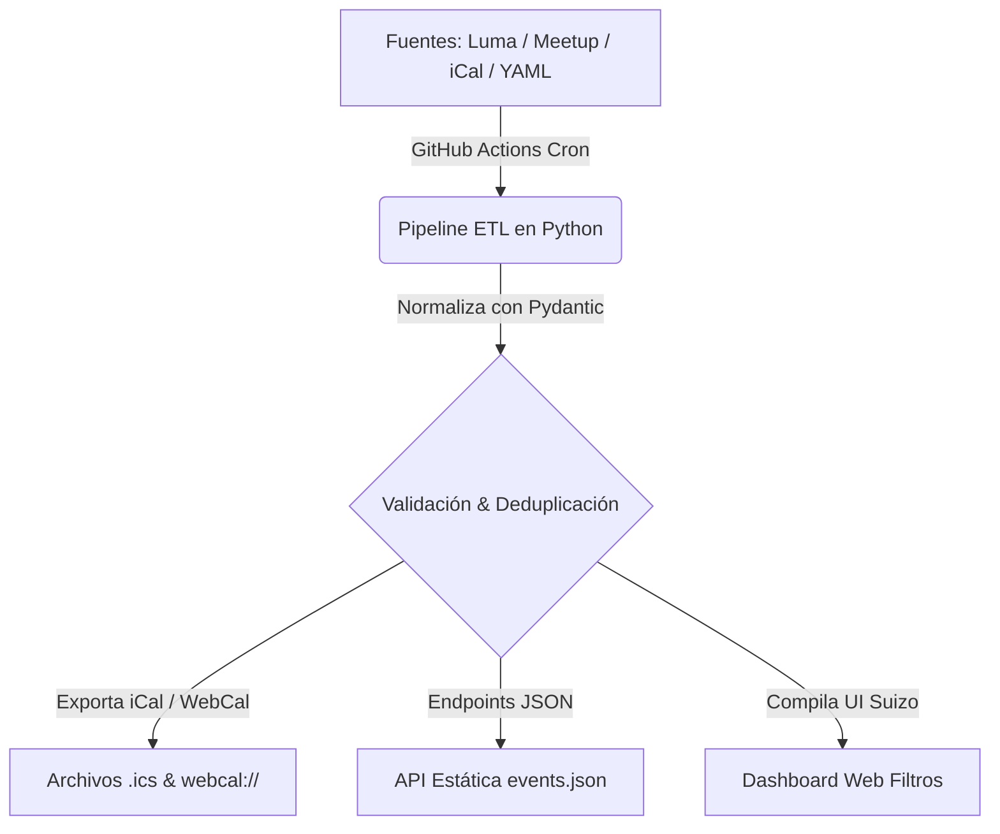

> [!NOTE]
> **Definición de Sistema:** **Cron-Quiles** es un agregador ETL de código abierto que consolida eventos tecnológicos en México, normalizando fuentes heterogéneas en calendarios estáticos (`.ics`), feeds `WebCal` y endpoints `JSON`.

<div class="post-preview-image">
  
</div>

> [!TIP]
> **Acciones del Proyecto:**  
> <a href="https://shellaquiles.github.io/cron-quiles/" target="_blank" rel="noopener" class="btn btn-main"><i data-lucide="globe"></i> Explorar Proyecto ↗</a> &nbsp;
> <a href="https://github.com/shellaquiles/cron-quiles" target="_blank" rel="noopener" class="btn btn-outline"><i data-lucide="github"></i> Repositorio GitHub ↗</a>

---

## 01. El Problema: Eventos tech dispersos por todos lados

Si formas parte de la comunidad de desarrolladores en México, seguro te ha pasado: la información sobre meetups, conferencias y talleres está completamente fragmentada. Un grupo publica en Luma, otro en Meetup, algunos en Eventbrite y otros tantos en sitios independientes o redes sociales.

Seguirle la pista a cada comunidad requiere revisar decenas de sitios manualmente, lo que provoca que te enteres de eventos increíbles cuando ya pasaron.

Para resolver esa dispersión creamos **Cron-Quiles**.

---

## 02. La Solución: Pipeline ETL de Agregación Automática

Cron-Quiles es un agregador automatizado en Python que extrae, valida, limpia y normaliza los calendarios de múltiples comunidades técnicas en un único feed centralizado.



### Directrices y Capacidades del Sistema

* `// MOTOR ETL` — **Pipeline Asíncrono en Python:** Extracción concurrente de eventos y validación estricta de esquemas con Pydantic.
* `// GEOLOCALIZACIÓN` — **Segmentación Regional:** Generación automática de calendarios específicos para CDMX, Jalisco (JAL), Puebla (PUE) y Nuevo León (NLE).
* `// DATOS ABIERTOS` — **Feeds Estáticos:** Exportación en estándar RFC 5545 (`.ics`), suscripciones `webcal://` y endpoints `.json` optimizados.
* `// UI/UX TIPO TERMINAL` — **Dashboard Ligero:** Interfaz estática de alto rendimiento y bajo consumo de datos para consulta rápida.
* `// SIN SERVIDORES` — **Sincronización CI/CD:** Ejecución periódica mediante GitHub Actions, publicando archivos estáticos de alta disponibilidad en GitHub Pages.

---

## 03. Matriz de Componentes

| Módulo | Función Principal | Formato / Salida |
| :--- | :--- | :--- |
| **Pipeline ETL** | Extracción, limpieza y parsing de fuentes heterogéneas | Objetos normalizados en memoria |
| **Generador iCal** | Compilación de eventos bajo estándar RFC 5545 | Archivos `.ics` y `webcal://` |
| **API Estática** | Endpoints ligeros para integración con apps y bots | `events.json`, `cdmx.json`, etc. |
| **Web Dashboard** | Interfaz de consulta con filtros por ciudad y tecnología | Sitio estático HTML5 / CSS Suizo |
| **Registry YAML** | Registro declarativo de comunidades integradas | `data/communities/*.yaml` |

---

## 04. Cómo Suscribirte o Consumir los Datos

Puedes integrar los calendarios directamente en Google Calendar, Apple Calendar o usarlos en tus propios scripts:

```bash
# Suscribirse al feed general de México en tu aplicación de calendario (WebCal)
webcal://cron-quiles.org/feeds/mexico.ics

# Consumir el endpoint JSON para eventos en CDMX con cURL y jq
curl -s https://cron-quiles.org/data/cdmx.json | jq '.[0]'
```

---

## 05. Registrar tu Comunidad (Paso a Paso)

> [!TIP]
> Cualquier comunidad técnica o meetup sin fines de lucro en México puede integrarse al feed general enviando un Pull Request.

1. **Fork del Repositorio:** Clona [github.com/shellaquiles/cron-quiles](https://github.com/shellaquiles/cron-quiles).
2. **Crear archivo de comunidad:** Agrega un archivo YAML en `data/communities/`:

```yaml
name: "Python CDMX"
region: "CDMX"
source_type: "luma"
feed_url: "https://api.lu.ma/ics/get?entity=calendar&id=cal-xxx"
tags: ["python", "backend", "data"]
```

3. **Enviar Pull Request:** Una vez aprobado el PR, el pipeline automático incluirá tus eventos en la siguiente ejecución del cron.

---

## 06. Preguntas Frecuentes

> [!IMPORTANT]
> **¿Tiene algún costo registrar mi comunidad en Cron-Quiles?**  
> Ninguno. Cron-Quiles es un proyecto 100% de código abierto mantenido por la comunidad Shellaquiles para apoyar la difusión tecnológica en México.

---

```text
STATUS: 200 OK // REVISION: v2.0.0 // PIPELINE: CI_AUTOMATED // SYS: CRON-QUILES.ORG
```
