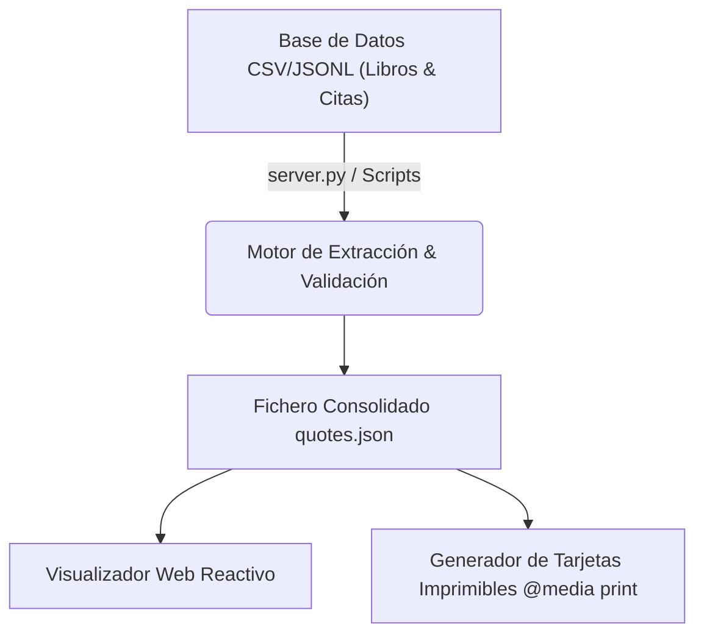

> [!NOTE]
> **Definición de Sistema:** **Frases Chingonas** es una base de conocimiento y herramienta web que condensa principios clave de libros clásicos de computación, arquitectura de software e ingeniería de sistemas en cápsulas concisas para consulta rápida.

> [!TIP]
> **Acciones del Proyecto:**  
> <a href="https://shellaquiles.github.io/frases-chingonas/" target="_blank" rel="noopener" class="btn btn-main"><i data-lucide="globe"></i> Explorar Proyecto ↗</a> &nbsp;
> <a href="https://github.com/shellaquiles/frases-chingonas" target="_blank" rel="noopener" class="btn btn-outline"><i data-lucide="github"></i> Repositorio GitHub ↗</a>

---

## 01. El Problema: Lecciones valiosas diluidas en cientos de páginas

Los fundamentos del buen desarrollo de software —las lecciones sobre Clean Code, diseño de sistemas, refactorización y arquitectura— suelen encontrarse dispersos en extensos libros de cientos de páginas.

Durante revisiones de código (*Code Reviews*), sesiones de arquitectura o debates técnicos en el equipo, recordar el principio exacto o la frase canónica de autores clásicos puede marcar la diferencia entre una discusión teórica estéril y un criterio de ingeniería claro.

Para rescatar y condensar esa sabiduría práctica creamos **Frases Chingonas**.

---

## 02. La Solución: Catálogo Atómico y Visualizador Web

Frases Chingonas estructura esos principios en declaraciones concisas, atómicas y ejecutables. El proyecto funciona como una aplicación web estática ultraligera que permite consultar citas por autor, libro o categoría, e incluso generar fichas imprimibles para espacios de trabajo.



### Directrices y Filosofía del Catálogo

* `// PRESERVACIÓN` — **Fundamentos Vigentes:** Rescate de patrones arquitectónicos de libros canónicos del software.
* `// SÍNTESIS ATÓMICA` — **Sin Rodeos:** Ideas complejas reducidas a reglas directas aplicables al código en producción.
* `// DUALIDAD DIGITAL/FÍSICA` — **Consumo Flexible:** Diseñado tanto para consulta en navegador como para exportar e imprimir tarjetas de 3x3 cm.
* `// CERO DEPENDENCIAS EXTERNAS` — **Motor Local:** Selección aleatoria y filtrado por DOM/JS sin peticiones externas.

---

## 03. Matriz de Componentes del Proyecto

| Componente | Archivo / Tecnología | Función Principal |
| :--- | :--- | :--- |
| **Data Registry** | `frases.csv` / `libros.jsonl` | Catálogo estructurado de libros, capítulos, autores y citas oficiales. |
| **Visualizador Web** | HTML5 / JavaScript Vanilla | Dashboard estático interactivo con cambio dinámico de temas visuales. |
| **Motor de Servidor Local**| `server.py` (Python) | Servidor ligero de desarrollo para pruebas locales e inspección. |
| **Print Layout Engine** | CSS `@media print` | Hoja de estilos optimizada para impresión y corte de fichas físicas. |

---

## 04. Cómo Explorar y Contribuir

Puedes consultar el catálogo en línea o ejecutarlo en tu máquina:

* **Sitio Web Oficial:** [shellaquiles.github.io/frases-chingonas/](https://shellaquiles.github.io/frases-chingonas/)
* **Repositorio en GitHub:** [github.com/shellaquiles/frases-chingonas](https://github.com/shellaquiles/frases-chingonas)

> [!TIP]
> **¿Quieres agregar citas de tus libros técnicos favoritos?**  
> Toda contribución es bienvenida siempre que provenga de un texto técnico verificable con atribución precisa de autor y capítulo.

```bash
# 1. Clonar el repositorio
git clone https://github.com/shellaquiles/frases-chingonas.git
cd frases-chingonas

# 2. Iniciar el servidor local de pruebas
python server.py
```

---

## 05. Preguntas Frecuentes

> [!IMPORTANT]
> **¿Puedo imprimir las tarjetas para mi oficina o espacio de trabajo?**  
> Sí, la aplicación web incluye estilos CSS optimizados para impresión (`Ctrl + P`). Puedes exportar e imprimir directamente fichas en formato 3x3 cm.

---

```text
STATUS: 200 OK // REPO: READY // FORMAT: STATIC // SYS: SHELLAQUILES.ORG
```
