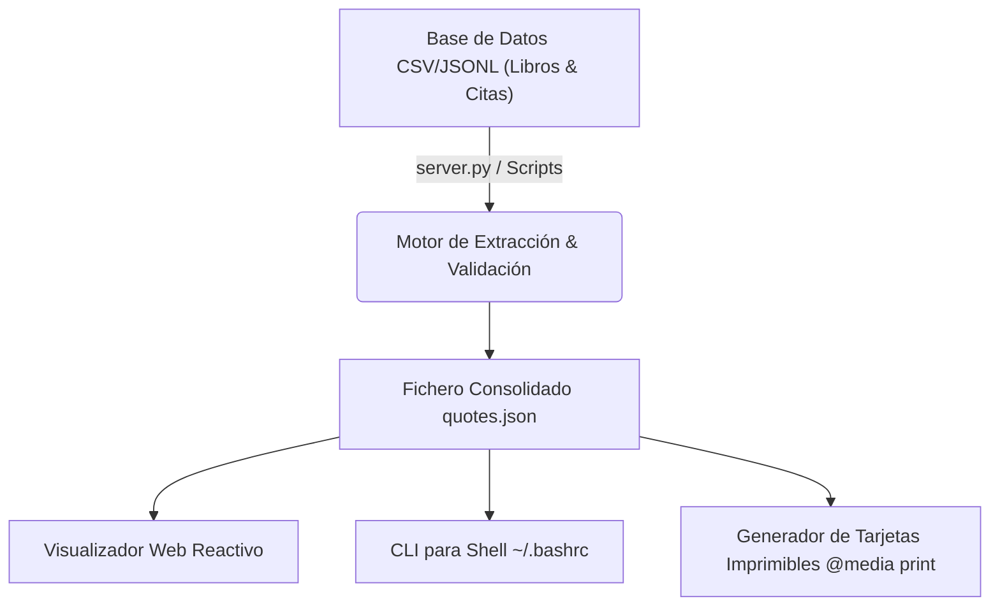

# $ cat proyectos/frases_chingonas.txt

> [!NOTE]
> **Definición de Sistema:** **Frases Chingonas** es una base de conocimiento, utilidad CLI y visualizador interactivo desarrollado en Python y Vanilla JS que condensa principios de libros clásicos de computación, arquitectura de software e ingeniería de sistemas en cápsulas concisas. Diseñado para consumirse vía web, imprimir tarjetas o ejecutarse en milisegundos en la terminal al abrir Zsh o Bash.

<div class="post-preview-image">
  
</div>

> [!TIP]
> **Acciones del Proyecto:**  
> <a href="https://shellaquiles.github.io/frases-chingonas/" target="_blank" rel="noopener" class="btn btn-main"><i data-lucide="play"></i> Explorar Web App ↗</a> &nbsp;
> <a href="https://github.com/shellaquiles/frases-chingonas" target="_blank" rel="noopener" class="btn btn-outline"><i data-lucide="github"></i> Repositorio GitHub ↗</a> &nbsp;
> <a href="/proyectos.html" class="btn btn-outline">Ver en Proyectos ↗</a>

---

## 01. El Problema: Lecciones Fundamentales Diluidas

Los fundamentos del buen desarrollo de software —las lecciones sobre Clean Code, diseño de sistemas, refactorización y arquitectura— suelen encontrarse dispersos en extensos libros de cientos de páginas.

Durante revisiones de código (*Code Reviews*), sesiones de arquitectura o debates técnicos en el equipo, recordar el principio exacto o la frase canónica de autores clásicos puede marcar la diferencia entre una discusión teórica estéril y un criterio de ingeniería claro.

Para rescatar y condensar esa sabiduría práctica creamos **Frases Chingonas**.

---

## 02. La Solución: Catálogo Atómico, CLI y Visualizador Web

Frases Chingonas estructura esos principios en declaraciones concisas, atómicas y ejecutables. El proyecto funciona como una aplicación web estática ultraligera que permite consultar citas por autor, libro o categoría, e inyectarlas en la terminal o imprimir fichas físicas para espacios de trabajo.


```mermaid
graph TD;
    A["Base de Datos CSV/JSONL (Libros & Citas)"] -->|server.py / Scripts| B(Motor de Extracción & Validación);
    B --> C[Fichero Consolidado quotes.json];
    C --> D[Visualizador Web Reactivo];
    C --> E[CLI para Shell ~/.bashrc];
    C --> F[Generador de Tarjetas Imprimibles @media print];
```

### Directrices y Filosofía del Catálogo

* `// PRESERVACIÓN` — **Fundamentos Vigentes:** Rescate de patrones arquitectónicos de libros canónicos del software (Linus Torvalds, Martin Fowler, Edsger Dijkstra, Rob Pike, Grace Hopper).
* `// SÍNTESIS ATÓMICA` — **Sin Rodeos:** Ideas complejas reducidas a reglas directas aplicables al código en producción.
* `// DUALIDAD DIGITAL/FÍSICA` — **Consumo Flexible:** Diseñado tanto para consulta en navegador como para exportar e imprimir tarjetas de 3x3 cm.
* `// CERO OVERHEAD` — **Motor Local:** Selección aleatoria y filtrado sin dependencias externas pesadas, ejecutándose en menos de 15 ms.

---

## 03. Colección Destacada: Axiomas de Ingeniería y Programación

Una muestra del dataset categorizado que indexa la herramienta:

| ID | Axioma / Frase de Programación | Autor / Origen | Categoría |
| :--- | :--- | :--- | :--- |
| `ARCH-01` | *"Talk is cheap. Show me the code."* | Linus Torvalds | `clean-code` |
| `DEBUG-04` | *"El código más rápido y con menos bugs es el que nunca se escribe."* | Principio Unix | `performance` |
| `SYS-12` | *"Cualquier programador puede escribir código que una máquina entienda. Los buenos programadores escriben código que los humanos entienden."* | Martin Fowler | `architecture` |
| `TEST-02` | *"Si una función no tiene pruebas automatizadas, en realidad es solo una hipótesis."* | Mantenedores Open Source | `devops` |
| `PROD-08` | *"Hay dos cosas verdaderamente difíciles en ciencias de la computación: invalidar caché y nombrar cosas."* | Phil Karlton | `architecture` |
| `LOG-03` | *"Un incidente en producción un viernes a las 5:00 PM no es mala suerte; es falta de pipeline de CI/CD."* | Ecosistema SRE | `production` |

---

## 04. Matriz de Componentes del Proyecto

| Componente | Archivo / Tecnología | Función Principal |
| :--- | :--- | :--- |
| **Data Registry** | `frases.csv` / `libros.jsonl` | Catálogo estructurado de libros, capítulos, autores y citas oficiales. |
| **Visualizador Web** | HTML5 / JavaScript Vanilla | Dashboard estático interactivo con cambio dinámico de temas visuales. |
| **Motor de Servidor Local**| `server.py` (Python) | Servidor ligero de desarrollo para pruebas locales e inspección. |
| **Print Layout Engine** | CSS `@media print` | Hoja de estilos optimizada para impresión y corte de fichas físicas. |

---

## 05. Cómo Explorar y Contribuir

Puedes consultar el catálogo en línea o ejecutarlo en tu máquina:

* **Sitio Web Oficial:** [shellaquiles.github.io/frases-chingonas/](https://shellaquiles.github.io/frases-chingonas/)
* **Repositorio en GitHub:** [github.com/shellaquiles/frases-chingonas](https://github.com/shellaquiles/frases-chingonas)

```bash
# 1. Clonar el repositorio
git clone https://github.com/shellaquiles/frases-chingonas.git
cd frases-chingonas

# 2. Iniciar el servidor local de pruebas
python server.py
```

### Inyección en la terminal

Agrega la siguiente línea al final de tu archivo de configuración de shell (`~/.zshrc` o `~/.bashrc`):

```bash
# Inyectar una frase de programación aleatoria al iniciar consola
if command -v frases-chingonas >/dev/null 2>&1; then
    frases-chingonas
fi
```

---

## 06. Sinergia con el Ecosistema Shellaquiles

Frases Chingonas condensa la filosofía técnica que permea todos los proyectos de nuestra comunidad:

* **[PEP 8: Guía de Estilo](/blog/pep8-python):** Consulta las bases del código limpio y el célebre Zen de Python de Tim Peters (`import this`).
* **[Hit-Tazos Tech](/blog/hit-tazos-tech-trivia-cronologica-para-programadores):** Pon a prueba tu conocimiento sobre los pioneros de la computación citados en este catálogo jugando a la trivia cronológica de 576 cartas.
* **[Pyquiles al Pastor](/blog/pyquiles-al-pastor-el-curso-de-python-con-sabor-mexicano):** Aprende a construir utilidades modulares como Frases Chingonas desde cero.

---

## 07. Preguntas Frecuentes

> [!IMPORTANT]
> **¿Puedo imprimir las tarjetas para mi oficina o espacio de trabajo?**  
> Sí, la aplicación web incluye estilos CSS optimizados para impresión (`Ctrl + P`). Puedes exportar e imprimir directamente fichas en formato 3x3 cm.

---

```text
STATUS: 200 OK // ENGINE: READY // DATASET: OPEN_SOURCE // SYS: SHELLAQUILES.ORG
```
