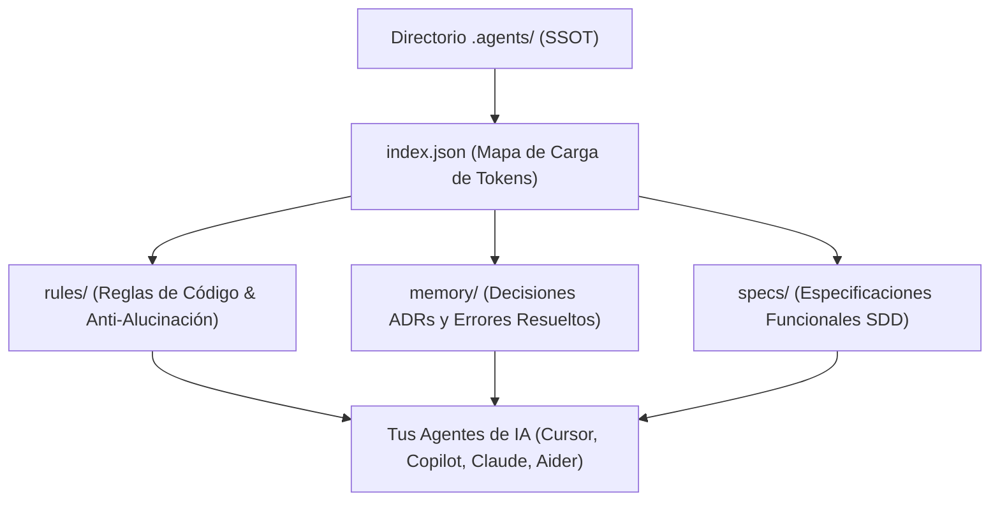

> [!NOTE]
> **Definición de Sistema:** **KARNITAS** (*Kernel Agentic Runtime Network for Intelligent Tasks & Automation Systems*) es una convención de código y directorio (`.agents/`) que actúa como la **única fuente de verdad (SSOT)** de contexto, memoria e instrucciones para agentes de IA en repositorios Git.

> [!TIP]
> **Acciones del Proyecto:**  
> <a href="https://github.com/shellaquiles/KARNITAS" target="_blank" rel="noopener" class="btn btn-main"><i data-lucide="globe"></i> Explorar Estándar ↗</a> &nbsp;
> <a href="https://github.com/shellaquiles/KARNITAS" target="_blank" rel="noopener" class="btn btn-outline"><i data-lucide="github"></i> Repositorio GitHub ↗</a>

---

## 01. El Problema: El caos de trabajar con agentes de IA en repositorios reales

Usar herramientas de IA para programar —ya sea Cursor, Copilot, Claude Code, Aider o agentes en la terminal— es increíblemente potente. Sin embargo, en cuanto el proyecto crece o entra más de una persona al equipo, comienzan los dolores de cabeza:

* `// ALUCINACIONES` — El agente sugiere utilizar una librería que el equipo **descartó formalmente hace dos meses**.
* `// PÉRDIDA DE MEMORIA` — Le pides a la IA arreglar un error y vuelve a proponer la misma solución fallida que ya habías corregido la semana pasada.
* `// INCONSISTENCIA` — Una persona usa Cursor con un prompt larguísimo, otra usa Copilot sin contexto y el código termina pareciendo escrito por cinco personas distintas.
* `// DESPERDICIO DE TOKENS` — Gastas miles de tokens en cada consulta porque no hay forma de decirle al asistente exactamente qué archivos debe leer y cuáles ignorar.

Para resolver esa falta de memoria y coherencia dentro de los repositorios creamos **KARNITAS**.

---

## 02. La Solución: El Estándar `.agents/`

KARNITAS no es una librería ejecutable ni un software comercial. Es un **estándar abierto de organización de archivos** dentro de tu propio proyecto Git.

La idea central es muy simple: crear un directorio llamado `.agents/` en la raíz de tu repositorio que funcione como la **Única Fuente de Verdad (SSOT)** tanto para los desarrolladores humanos como para cualquier asistente de IA.



### Principios Fundamentales

* `// ECONOMÍA DE TOKENS` — **Carga Inteligente:** En lugar de saturar la ventana de contexto, `.agents/index.json` define qué archivos leer siempre (`always_load`) y cuáles consultar bajo demanda (`context_map`).
* `// MEMORIA PERSISTENTE` — **Historial en Git:** Las razones por las que eligieron o descartaron una tecnología quedan guardadas en `.agents/memory/adrs/` y `.agents/memory/known_issues.md`.
* `// RESTRICCIONES RECTAS` — **Políticas Anti-Alucinación:** Definición explícita del stack en `.agents/rules/anti_hallucination.md`. Si un patrón no está en `.agents/`, no existe para la IA.
* `// SPEC BEFORE CODE` — **Spec-Driven Development (SDD):** Fomenta escribir la especificación en `.agents/specs/` antes de generar código.
* `// AGINABLE Y ABIERTO` — **Compatibilidad Total:** Funciona con cualquier IDE, cliente de terminal, LLM o proveedor al basarse en Markdown y JSON estándar.

---

## 03. Matriz de Componentes de la Arquitectura `.agents/`

| Componente | Archivo / Directorio | Descripción y Función |
| :--- | :--- | :--- |
| **Orquestador de Carga** | `.agents/index.json` | Índice principal que define la carga dinámica de tokens por tipo de tarea. |
| **Gobernanza General** | `.agents/rules/` | Directrices de estilo de código, testing, seguridad y políticas anti-alucinación. |
| **Memoria Histórica** | `.agents/memory/` | Registro de decisiones arquitectónicas (ADRs), stack técnico explícito y conocidos. |
| **Especificación (SDD)** | `.agents/specs/` | Documentos de requisitos, especificaciones funcionales y criterios de aceptación. |

---

## 04. Estructura Sugerida del Directorio

```text
tu-proyecto/
├── .agents/
│   ├── index.json               # Define qué lee el agente y cuándo
│   ├── rules/
│   │   ├── code_style.md        # Estilo de código y convenciones del equipo
│   │   └── anti_hallucination.md# Librerías prohibidas y límites estrictos
│   ├── memory/
│   │   ├── adrs/                # Registro de decisiones de arquitectura
│   │   ├── tech_stack.md        # Tecnologías y versiones oficialmente aprobadas
│   │   └── known_issues.md      # Bugs históricos resueltos para no repetirlos
│   └── specs/                   # Requerimientos y criterios de aceptación (SDD)
├── src/
└── README.md
```

---

## 05. Guía de Adopción Incremental

> [!TIP]
> No necesitas cambiar todo tu flujo de trabajo de un día para otro. Puedes integrar KARNITAS de forma progresiva en 3 sencillos pasos:

```bash
# 1. Clona el repositorio oficial para ver el arquetipo
git clone https://github.com/shellaquiles/KARNITAS.git
cd KARNITAS

# 2. Copia la plantilla base a tu repositorio
cp -r archetype /ruta/a/tu-proyecto/.agents
```

1. **Paso 1 (Mínimo Viable):** Crea `.agents/memory/tech_stack.md` escribiendo las tecnologías y versiones exactas que usa tu app.
2. **Paso 2 (Memoria e Historial):** Cuando resuelvas un bug difícil, anota una línea en `.agents/memory/known_issues.md` explicando cuál era la causa raíz.
3. **Paso 3 (Especificación SDD):** Antes de pedirle a la IA que cree una pantalla o módulo nuevo, redacta una nota rápida en `.agents/specs/`.

---

## 06. Preguntas Frecuentes

> [!IMPORTANT]
> **¿Reemplaza las reglas nativas como `.cursorrules` o `.clauderules`?**  
> No, las complementa. Puedes hacer que tus archivos nativos de configuración simplemente apunten a `.agents/index.json` o lean la carpeta `.agents/rules/`, manteniendo todo centralizado en un solo lugar.

> [!NOTE]
> **¿Se debe incluir `.agents/` en el control de versiones (Git)?**  
> **Sí, totalmente.** El objetivo de KARNITAS es que todo el equipo (y los agentes que use cada quien) compartan la misma fuente de verdad versionada en el repositorio.

---

```text
STATUS: 200 OK // RFC: v1.0.2 // ARCHITECTURE: .AGENTS/ // SYS: SHELLAQUILES.ORG
```
