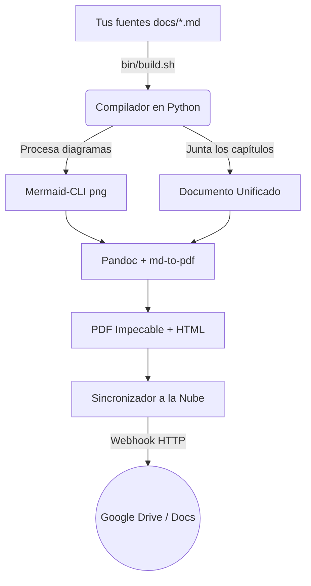

> [!NOTE]
> **Definición de Sistema:** **PanDocquiles** es un motor de conversión y publicación que toma tus fuentes Markdown con diagramas Mermaid, aplica estilos CSS corporativos y actualiza los artefactos (PDF e HTML) en Google Drive manteniendo el mismo enlace de acceso.

> [!TIP]
> <i data-lucide="github"></i> **Repositorio GitHub:** [github.com/shellaquiles/pandocquiles](https://github.com/shellaquiles/pandocquiles)

---

## 01. El Problema: Compartir documentación en Markdown fuera del repositorio

Escribir documentación en Markdown dentro de un repositorio Git es una de las decisiones más cómodas para cualquier desarrollador. Todo vive junto al código, las revisiones se hacen en Pull Requests y el control de versiones es impecable.

Sin embargo, **esa comodidad suele romperse cuando llega el momento de compartir los documentos fuera de la terminal o de GitHub**:

1. **La barrera ejecutiva:** Un cliente pide la propuesta de arquitectura en PDF. El equipo de producto quiere ver las especificaciones en un enlace de Google Drive.
2. **Diagramas rotos:** Al intentar exportar con herramientas convencionales, los diagramas de `Mermaid` no renderizan o las imágenes desbordan el margen de la página.
3. **Pérdida de tiempo:** Pasas horas copiando texto, arreglando estilos CSS, agregando portadas y reescribiendo metadatos EXIF.
4. **Enlaces rotos en la nube:** Cada vez que actualizas un documento y lo vuelves a subir a Google Drive, se genera un enlace nuevo, dejando obsoletos los accesos compartidos.

Para resolver ese problema del día a día creamos **PanDocquiles**.

---

## 02. La Solución: Pipeline Automatizado de Markdown a Nube

En pocas palabras, PanDocquiles toma una carpeta llena de archivos Markdown (como los capítulos de tu carpeta `docs/`), los une de forma ordenada, procesa los diagramas gráficos, les aplica estilos visuales limpios y publica los artefactos finales directamente en Google Drive.



### Directrices de Funcionamiento

* `// ENSAMBLADO` — **Unificación Secuencial:** Une archivos numerados (`01-*.md`, `02-*.md`) en un único documento, generando portada oficial y ajustando rutas relativas.
* `// DIAGRAMAS HD` — **Mermaid CLI Automation:** Renderiza bloques de diagramas a imágenes PNG de alta resolución antes de compilar para garantizar que nunca se rompan.
* `// TIPOGRAFÍA Y ESTILOS` — **CSS Corporativo:** Aplica plantillas `theme-pdf.css` y `theme-gdocs.css`, limitando imágenes a 650px para vista previa limpia en Google Docs.
* `// METADATOS EXIF` — **Propiedades Oficiales:** Escribe autor, versión, título y organización en las propiedades internas del PDF usando `Exiftool`.
* `// ENLACE PERMANENTE` — **Webhook Apps Script:** Sincroniza con Google Drive reemplazando el contenido del archivo sin cambiar la URL original.

---

## 03. Matriz de Componentes del Sistema

| Módulo | Tecnología | Responsabilidad |
| :--- | :--- | :--- |
| **Orquestador CLI** | Bash (`bin/build.sh`) | Coordinador de opciones CLI, banderas (`--pdf-only`) y secuencia. |
| **Compilador Core** | Python 3 (`src/python/compiler.py`) | Unificación de Markdown, ordenamiento, portadas y config JSON. |
| **Renderizador Gráfico**| Node.js (`@mermaid-js/mermaid-cli`) | Extracción y conversión de diagramas Mermaid a PNG. |
| **Format Engine** | Pandoc & `md-to-pdf` | Conversión a PDF e HTML usando hojas de estilo CSS. |
| **Metadata Injector** | ExifTool | Inyección de propiedades EXIF oficiales en el PDF final. |
| **Cloud Sync** | Webhook JS (`drive_webhook.js`) | Receptor Apps Script en Google Drive para actualización de ID. |

---

## 04. Casos de Uso Reales

### 1. Entregables de Arquitectura para Clientes
Compila tu carpeta de especificaciones técnicas en un PDF con apariencia profesional minutos antes de una reunión importante.

### 2. Integración en CI/CD (GitHub Actions / GitLab CI)
Agrega PanDocquiles a tu pipeline para que cada vez que hagas un `git push` a la rama principal, la versión final en Google Drive se actualice automáticamente.

### 3. Documentación Abierta de Proyectos
Mantén tu documentación interna sincronizada tanto para desarrolladores en Markdown como para usuarios finales en PDF.

---

## 05. Guía de Inicio Rápido

> [!TIP]
> Puedes probar PanDocquiles en local o agregarlo como submódulo Git en cualquier proyecto existente.

### Uso Rápido en Local

```bash
# 1. Clonar e iniciar
git clone https://github.com/shellaquiles/pandocquiles.git
cd pandocquiles

# 2. Configurar variables de entorno (título de tu empresa, webhook de Drive)
cp .env.example .env

# 3. Compilar la documentación (Genera PDF e HTML)
./bin/build.sh
```

Si solo quieres generar el PDF a máxima velocidad:

```bash
# Compilar únicamente PDF
./bin/build.sh --pdf-only

# Compilar un directorio de documentación personalizado
./bin/build.sh --pdf-only /ruta/a/tu/proyecto/docs
```

### Agregar como Submódulo Git

```bash
# Agregar PanDocquiles a tu repositorio existente
git submodule add https://github.com/shellaquiles/pandocquiles.git tools/pandocquiles

# Compilar la documentación de tu app cuando lo necesites
./tools/pandocquiles/bin/build.sh docs
```

---

## 06. Preguntas Frecuentes

> [!IMPORTANT]
> **¿Puedo personalizar el logotipo y los colores del PDF?**  
> Sí. Dentro de la carpeta `config/css/` puedes modificar los colores, fuentes y márgenes para adaptar la salida visual a la identidad de tu marca o empresa.

> [!NOTE]
> **¿Qué pasa si no configuro el Webhook de Google Drive?**  
> PanDocquiles seguirá funcionando perfectamente. Compilará todos los archivos en tu carpeta local `documentacion/` o `dist_docs/` para que los uses como prefieras.

---

```text
STATUS: 200 OK // ENGINE: PANDOC+MERMAID // REPO: READY // SYS: SHELLAQUILES.ORG
```
