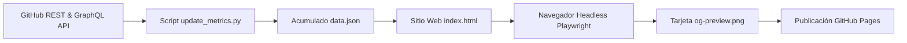

> [!NOTE]
> **Definición de Sistema:** **Stats** es un dashboard web estático y automático que recolecta, consolida y visualiza la **Huella Digital** de tus repositorios en GitHub (stars, clones, visitas, commits y colaboradores) sin costo de servidores.

> [!TIP]
> <i data-lucide="github"></i> **Repositorio GitHub:** [github.com/shellaquiles/stats](https://github.com/shellaquiles/stats)  
> <i data-lucide="globe"></i> **Página Pública / Dashboard:** [shellaquiles.github.io/stats](https://shellaquiles.github.io/stats/)

---

## 01. El Problema: Pérdida de métricas de tráfico y falta de visibilidad global

Si mantienes proyectos de código abierto o tienes varios repositorios públicos en GitHub, es muy probable que te hayas topado con esta frustrante limitación: **GitHub solo guarda los datos de visitas y clones durante 14 días**.

Pasadas dos semanas, si no apuntaste o descargaste esa información, los datos de tráfico de tu proyecto desaparecen para siempre. Además, si quieres ver el impacto total de todo lo que has construido (estrellas acumuladas, forks globales, colaboradores activos o tendencias), tienes que ir dando clics de repositorio en repositorio.

Para resolver esto y tener una radiografía completa de tu trabajo creamos **Stats**.

---

## 02. La Solución: Telemetría Automática y Dashboard Estático

Stats es un **dashboard web estático y automático** que recolecta diariamente las métricas de tus repositorios mediante la API de GitHub, las guarda en un archivo de datos dentro del mismo repositorio y publica una página web pública y bonita en GitHub Pages.

Todo el proceso corre de forma 100% gratuita utilizando GitHub Actions, sin necesidad de contratar bases de datos, servidores o servicios en la nube.



### Directrices y Capacidades Clave

* `// HISTORIAL INCANCELABLE` — **Persistencia Incremental:** Consulta diariamente la API de tráfico y acumula visitas y clones en `data.json`, impidiendo que GitHub borre tu información.
* `// HUELLA DIGITAL` — **Radar Multieje:** Gráfico de tipo Radar que evalúa la salud técnica ponderando Stars, Forks, Commits, Clones y Visitas únicas.
* `// SOCIAL PREVIEW` — **Playwright Automation:** Navega en headless sobre el dashboard, toma una captura en alta resolución (2400x1260 px) y genera el archivo `og-preview.png` para redes sociales.
* `// RECONOCIMIENTO` — **Tabla de Colaboradores:** Muestra los contribuidores reales excluyendo bots de automatización (como Dependabot).
* `// ZERO CONFIG` — **Autodetección:** Solo necesitas hacer Fork del proyecto y el sistema detectará tu usuario automáticamente.

---

## 03. Matriz de Componentes del Sistema

| Módulo | Tecnología | Propósito y Función |
| :--- | :--- | :--- |
| **API Synchronizer** | Python 3.10+ (`scripts/update_metrics.py`) | Extracción concurrente de métricas vía REST y GraphQL API. |
| **Data Lake Estático** | `data.json` | Registro histórico acumulativo de métricas de todos los repos. |
| **Frontend UI** | HTML5 / CSS Suizo / Chart.js | Dashboard interactivo con tablas ordenables y gráficos. |
| **OG Image Engine** | Playwright Headless (`scripts/generate_preview.py`) | Renderizado headless que exporta la miniatura `og-preview.png`. |
| **CI/CD Orchestrator** | GitHub Actions & GitHub Pages | Pipeline cron diario (06:00 UTC) y despliegue a `gh-pages`. |

---

## 04. Guía de Inicio Rápido (3 Minutos)

> [!TIP]
> Cualquier usuario u organización puede desplegar su propio portal de telemetría haciendo un Fork del repositorio.

1. **Paso 1 (Haz Fork):** Ve a [github.com/shellaquiles/stats](https://github.com/shellaquiles/stats) y haz clic en el botón **Fork** hacia tu cuenta personal u organización.
2. **Paso 2 (Activa GitHub Pages):** En tu repositorio, ve a *Settings > Pages*, selecciona `Deploy from a branch`, elige la rama `gh-pages` y guarda.
3. **Paso 3 (Sincronización Inicial):** Ve a la pestaña *Actions*, selecciona el workflow `Auto-Sync Telemetry & Deploy to GitHub Pages` y presiona **Run workflow**.

En un minuto, tu dashboard estará publicado en `https://<TU_USUARIO>.github.io/stats/` y se actualizará solo cada 24 horas.

---

## 05. Desarrollo Local y Personalización

```bash
# 1. Clonar tu repositorio
git clone https://github.com/<TU_USUARIO>/stats.git
cd stats

# 2. Levantar el servidor local (http://localhost:8000)
make dev

# 3. Probar la generación de la tarjeta social
make preview
```

---

## 06. Preguntas Frecuentes

> [!IMPORTANT]
> **¿Funciona con cuentas de organización o solo cuentas personales?**  
> Funciona perfectamente con ambas. Si haces fork desde una organización, Stats detectará la cuenta del propietario y extraerá los repositorios públicos pertenecientes a esa organización.

> [!NOTE]
> **¿Tiene algún costo o requiere API Keys pagadas?**  
> Ninguno. Utiliza la autenticación automática de `GITHUB_TOKEN` provista por GitHub Actions y se aloja gratis en GitHub Pages.

---

```text
STATUS: 200 OK // ENGINE: GITHUB_ACTIONS+PLAYWRIGHT // SYS: SHELLAQUILES.ORG
```
