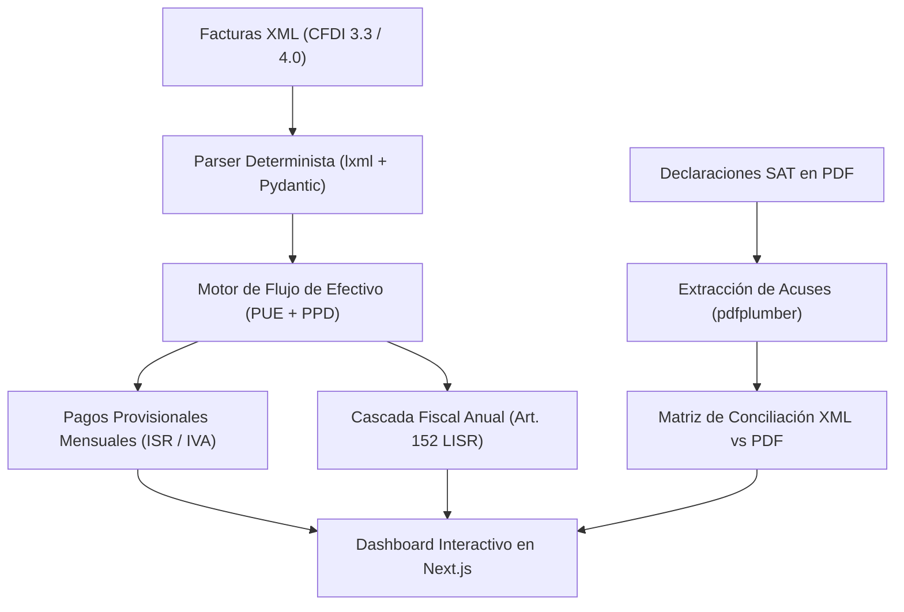

# $ cat proyectos/tributacos.txt

> [!NOTE]
> **Definición de Sistema:** **tribuTACOS** es una plataforma de software libre y ejecución 100% local concebida para que desarrolladores, consultores y profesionistas independientes en México tomen el control de sus impuestos. Procesa comprobantes XML (**CFDI 3.3 y 4.0**) y declaraciones oficiales en PDF del SAT, calculando por anticipado y bajo el principio de **flujo de efectivo** los Pagos Provisionales Mensuales (ISR/IVA) y la Declaración Anual.

<div class="post-preview-image">
  
</div>

> [!TIP]
> **Acciones del Proyecto:**  
> <a href="https://github.com/shellaquiles/tribuTACOS" target="_blank" rel="noopener" class="btn btn-main"><i data-lucide="github"></i> Repositorio GitHub ↗</a> &nbsp;
> <a href="/proyectos.html" class="btn btn-outline">Ver en Proyectos ↗</a>

---

## 01. El Problema: La Incertidumbre Fiscal ante el SAT

Para cualquier profesionista independiente, consultor por honorarios o empleado en México (Régimen de Servicios Profesionales, Actividad Empresarial o Sueldos y Salarios), la relación con el SAT suele generar fricción e incertidumbre:

1. **Incertidumbre mensual:** ¿Cuánto dinero exactamente debo reservar para pagar ISR e IVA este mes?
2. **Retenciones desalineadas:** ¿Mis clientes aplicaron correctamente las retenciones del 10% de ISR y las dos terceras partes de IVA?
3. **Saldo a favor impredecible:** ¿Llegaré al mes de abril con un saldo a favor en la Declaración Anual o con un saldo a cargo imprevisto?
4. **Suboptimización de deducciones:** ¿Estoy aprovechando al máximo mis gastos médicos, colegiaturas y aportaciones complementarias antes de topar el límite legal de 5 UMAs anuales (Art. 151 LISR)?

**tribuTACOS** fue diseñado para sustituir la incertidumbre con matemáticas transparentes, código auditable y privacidad absoluta.

---

## 02. La Solución: Simulación Fiscal Determinista y Local

tribuTACOS no envía jamás tu información financiera a la nube de terceros. Se ejecuta localmente en tu propia máquina mediante un stack moderno en **Python (FastAPI)** y **Next.js 15**, procesando tus comprobantes XML directamente contra una base de datos local SQLite o PostgreSQL.



---

## 03. Directrices y Módulos de Cálculo

* `// FLUJO DE EFECTIVO` — **Pre-Declaración Mensual:** Simula pagos provisionales basándose únicamente en facturas efectivamente cobradas (PUE) y complementos de recepción de pagos (PPD), con cálculo automático del **arrastre de saldos a favor de IVA** (Art. 5 y 6 LIVA).
* `// CASCADA FISCAL` — **Declaración Anual (Art. 152 LISR):** Aplica la tarifa anual progresiva en 5 pasos deterministas:
  $$\text{Ingresos Acumulables} \longrightarrow \text{Deducciones Personales} \longrightarrow \text{Base Gravable} \longrightarrow \text{ISR Determinado} \longrightarrow \text{Saldo Neto}$$
* `// TAXONOMÍA SAT` — **Mapeo de Claves c_ClaveProdServ:** Clasifica de forma automática más de 52,000 claves del catálogo del SAT en 8 rubros operativos para identificar gastos deducibles.
* `// OPTIMIZADOR LEGAL` — **Deducciones Personales (Art. 151 LISR):** Audita que los pagos médicos y dentales cumplan con medios bancarizados obligatorios y aplica el tope legal estricto (el menor entre el 15% de los ingresos o 5 UMAs anuales).
* `// AUDITORÍA PUNTO A PUNTO` — **XML vs PDF Oficial:** Compara los montos de tus facturas locales contra lo que el SAT declaró en sus acuses oficiales en PDF, detectando discrepancias al centavo.

---

## 04. Matriz Comparativa de Módulos

| Módulo | Enfoque Operativo | Regla / Estándar SAT |
| :--- | :--- | :--- |
| **Tablero Global** | KPIs consolidados de ingresos brutos, gastos y proyección neta | Visión holística multirregimen |
| **Pre-Declaración Mensual** | Flujo de efectivo, cálculo de ISR provisional e IVA trasladado vs acreditable | Art. 106 LISR / Art. 5 y 6 LIVA |
| **Declaración Anual** | Cascada fiscal de 5 pasos, cálculo de tasa efectiva y tasa marginal | Tarifa Progresiva Art. 152 LISR |
| **Auditoría de Gastos** | Clasificación taxonómica en 8 rubros y validación de métodos de pago | Catálogo `c_ClaveProdServ` SAT |
| **Deducciones Personales** | Optimización de honorarios médicos, seguros de gastos médicos y PPR | Art. 151 LISR / Topes UMA |
| **Conciliación PDF vs XML** | Cruce de facturas vivas contra declaraciones y acuses oficiales | Líneas de captura y folios SAT |

---

## 05. Stack Tecnológico de Grado Industrial

* **Backend:** Python 3.11+, FastAPI 0.141, SQLAlchemy 2.0, Pydantic v2, `lxml` y `pdfplumber`.
* **Frontend:** Next.js 15 (App Router), React 19, Tailwind CSS.
* **Base de datos:** SQLite local (`tributacos.db`) o PostgreSQL para instalaciones multiusuario.
* **Seguridad:** Cero telemetría externa, datos aislados en la máquina del contribuyente.

---

## 06. Guía de Inicio Rápido en 3 Comandos

El proyecto cuenta con un `Makefile` integral para desplegar la plataforma localmente:

```bash
# 1. Clonar el repositorio
git clone https://github.com/shellaquiles/tributacos.git
cd tributacos

# 2. Configurar el entorno virtual y base de datos
make setup

# 3. Iniciar Backend (puerto 8000) y Frontend (puerto 3000)
make dev
```

Abre `http://localhost:3000` en tu navegador, arrastra tu carpeta de comprobantes XML y comienza a proyectar tus impuestos con certeza absoluta.

---

## 07. Integración con la Comunidad Shellaquiles

tribuTACOS es un pilar de la soberanía técnica comunitaria promovida en [Shellaquiles.org](/):

* **[Catálogo de Proyectos](/proyectos.html):** Consulta el estado de producción de tribuTACOS y explora otras herramientas de software libre de nuestra comunidad.
* **[Stats GitHub](/blog/stats-dashboard-de-telemetria-web-y-huella-digital-de-repositorios):** Sigue la evolución de clones, estrellas e issues en el repositorio de tribuTACOS.
* **[Pyquiles al Pastor](/blog/pyquiles-al-pastor-el-curso-de-python-con-sabor-mexicano):** tribuTACOS es un ejemplo avanzado de arquitectura limpia con FastAPI y Pydantic estudiado en nuestro curso de Python.

---

## 08. Preguntas Frecuentes

> [!IMPORTANT]
> **¿Mis facturas XML se envían a algún servidor externo?**  
> No. tribuTACOS está diseñado bajo una arquitectura *local-first*. Toda la información de tus comprobantes fiscales y CFDIs se procesa exclusivamente en tu propia máquina mediante tu base de datos local SQLite, garantizando total privacidad financiera.

---

```text
STATUS: 200 OK // STACK: FASTAPI+NEXTJS15 // TAX_YEAR: 2026 // PRIVACY: LOCAL_FIRST
```
